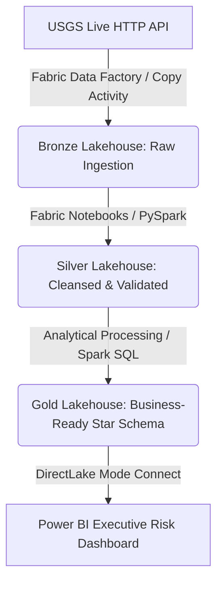

# Worldwide Earthquake Telemetry & Risk Analytics Platform

A production-grade, end-to-end data platform built entirely within the **Microsoft Fabric** ecosystem (Data Factory, Data Engineering, and Power BI). The platform ingests real-time seismic event telemetry from the United States Geological Survey (USGS) API, refines it through a structured **Lakehouse Medallion Architecture**, and serves high-value geofenced intelligence models for global risk analysis.

---

## 🌐 Live Project Showcase
🚀 **Interactive Web Application:** [Explore the Live App Presentation](https://lovableproject.com)
*   **Live Preview Documentation:** View the interactive project slide narrative, architecture deep-dives, and platform insights directly at `/docs`.

---

## 🎯 Business Case & Objectives
Seismic disruptions pose immediate hazards to infrastructure, supply chains, and human life. Standard raw data feeds from planetary monitoring stations are highly fragmented. This project builds a centralized, low-latency automated pipeline to ingest, clean, and model global earthquake events—enabling risk managers to extract actionable geographic density patterns and macro-magnitude trends.

---

## 🏗️ Architecture & Data Flow

The platform implements decoupled compute and serverless storage patterns inside **Microsoft Fabric** utilizing PySpark engines and Delta Lake open table formats.

---

## 📷 Engineering Deep-Dive & Medallion Pipeline Tour

### 1. Raw Data Ingestion (Bronze Layer)
*   **Notebook:** `Worldwide Earthquake Events API - Bronze Layer Processing`
*   **Engine:** Fabric Data Engineering (Python / Requests / PySpark SparkSession)
*   **Core Logic:** Connects to the raw USGS API endpoint, extracts the structural JSON payload, and executes an optimized dump directly to an immutable Bronze storage directory to capture full historic lineage without loss.

### 2. Cleansing, Standardization & Validation (Silver Layer)
*   **Notebook:** `Worldwide Earthquake Events API - Silver Layer Processing`
*   **Engine:** Fabric Data Engineering (PySpark DataFrame API)
*   **Core Logic:** Enforces structural schema constraints, handles missing or malformed records, normalizes raw location fields into clean spatial strings, parses microsecond UNIX epochs into target timestamp fields, and filters out telemetry anomalies.

### 3. Star-Schema Modeling & Aggregation (Gold Layer)
*   **Notebook:** `Worldwide Earthquake Events API - Gold Layer Processing`
*   **Engine:** Fabric Data Engineering / Spark SQL
*   **Core Logic:** Aggregates processed seismic rows into high-performance analytical datasets. It constructs dimensional metrics optimized for high-velocity map projections and historical time-intelligence reporting natively within Power BI via **DirectLake Mode**.

---

## 📊 Semantic Layer: Data Dictionary

The polished Gold-tier schema enforces strict type casting to ensure high-fidelity spatial and mathematical queries:

| Attribute Name | Data Type | Engineering Description & Business Context |
| :--- | :--- | :--- |
| **id** | `STRING` | Globally unique identifier representing a single verified seismic event footprint. |
| **latitude** | `DOUBLE` | Geospatial geographic coordinate mapping the north-south axis position. |
| **longitude** | `DOUBLE` | Geospatial geographic coordinate mapping the east-west axis position. |
| **elevation** | `DOUBLE` | The vertical distance relative to sea level at which the event occurred (meters). |
| **title** | `STRING` | Executive summary heading of the seismic event (e.g., Magnitude + Location snippet). |
| **place_description** | `STRING` | Human-readable formalized location narrative and proximity indicator. |
| **sig** | `BIGINT` | Significance score matrix assessing total impact (computed via magnitude, damage reports, and felt alerts). |
| **mag** | `DOUBLE` | Absolute magnitude scale calculation recording total energy released by the shockwave. |
| **magType** | `STRING` | The technical algorithmic method or scale metric utilized to measure the intensity (e.g., mw, mb). |
| **time** | `TIMESTAMP` | Normalized execution clock timestamp capturing the precise origin moment of the earthquake. |
| **updated** | `TIMESTAMP` | Chronological metadata log recording the last system refresh or downstream revision. |

---

## 💻 Tech Stack
*   **Orchestration:** Fabric Data Factory (Pipelines & Schedules)
*   **Compute Engines:** Fabric Data Engineering (PySpark, Spark SQL, Spark Core clusters)
*   **Storage Architecture:** OneLake, Delta Lake Table Format
*   **Visualization Layer:** Power BI Desktop / Fabric Service Workspace (DirectLake Connectivity)

---

## 🚀 Deployment & Operational Guide

### 1. Workspace Prerequisites
*   An active **Microsoft Fabric Capacity Account** (or a Fabric Trial sandbox).
*   Workspace Administrator permissions (or coordination with your tenant administrator to enable notebook execution policies).
*   Fundamental conceptual familiarity with Apache Spark computing, Python data handling libraries, and star schema modeling rules.

### 2. Manual Pipeline Execution Sequence
To deploy the platform pipelines manually, download the notebooks from this repository and import them into your Fabric Data Engineering environment, executing them in the following order:
1.  `Worldwide Earthquake Events API - Bronze Layer Processing.ipynb`
2.  `Worldwide Earthquake Events API - Silver Layer Processing.ipynb`
3.  `Worldwide Earthquake Events API - Gold Layer Processing.ipynb`

---
*Project engineered for modern cloud data platform evaluation.*
